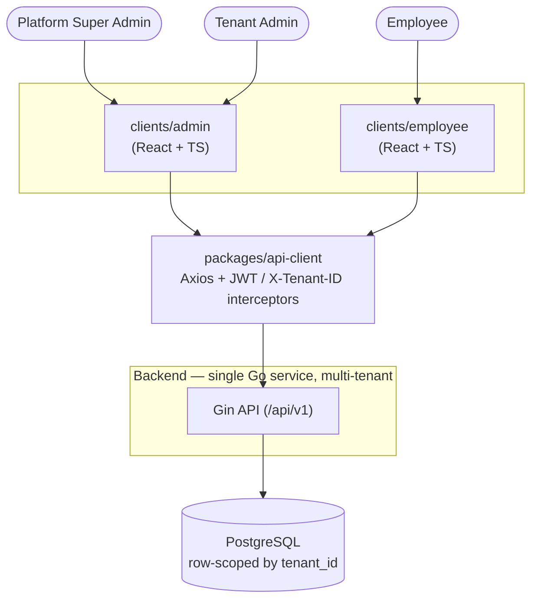
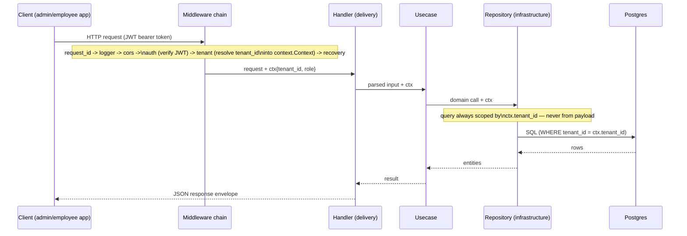

# Architecture Overview (Diagrams)

Rendered companion to `backend.md` and `frontend.md` — read this first for a
quick visual, then those two for full directory trees and rationale.

**Tooling note**: these are [Mermaid](https://mermaid.js.org) diagrams,
embedded as plain text so they render natively on GitHub and in Claude Code
with no extra tooling, and diff cleanly in git as the design evolves across
cycles. This file stays the fast, low-friction entry point — quick glance
while browsing the repo or a PR diff, no build step, no browser required.

There's a second, deliberately different diagram format alongside it:
[`plan/architecture/diagrams/`](diagrams/) holds detailed, presentation-oriented
HTML+SVG diagrams for `backend.md`, `frontend.md`, and this file, with
exportable PNG/PDF output, generated via the `architecture-diagram` Claude Code skill
(`.claude/skills/architecture-diagram/`, MIT-licensed, authored by
[Cocoon AI](mailto:hello@cocoon-ai.com) — hand-drawn SVG from these plan docs,
not introspected from code). Those are for deep dives and sharing outside the
repo, not for quick in-repo reading, so the "Backend: Clean Architecture
Layers" diagram that used to live here has moved there in full — see
`diagrams/backend-architecture.html` for a much more detailed version (actual
file names, arrows, dependency-inversion callout). This split is intentional,
not a reversal of the diffability rationale above: Mermaid for fast/diffable
reading, HTML for detailed/exportable presentation.

Two other open-source alternatives were considered and set aside for now
(neither is what produced `diagrams/`, above):
- **[Archify](https://github.com/tt-a1i/archify)** — an AI agent skill that
  introspects an existing codebase into a verified, interactive diagram. Its
  value is in reading *real code*; there isn't any yet (this repo is still
  planning-docs-only). Worth revisiting once Cycle 1/2 land actual backend
  code, to auto-generate a diagram from the implementation rather than
  hand-maintaining one from the plan.
- **Structurizr** (C4 model, self-hostable via `Structurizr Lite`) — a good
  heavier-weight option later if the C4 Context/Container/Component/Code
  levels become worth formalizing; overkill for the current stage.

---

## 1. System Context

Roles, client apps, and the tenant boundary at a glance.

## 2. Request Lifecycle & Multi-Tenant Resolution

How a request flows through the middleware chain and gets tenant-scoped
(Invariant 1) before it ever reaches persistence.

